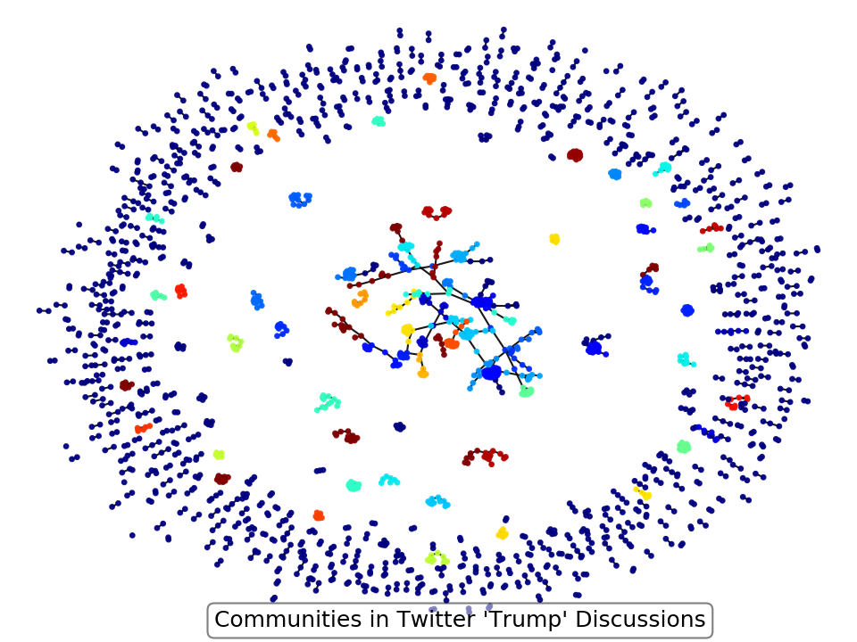

# Network Analysis on Tweets

Twitter is a weird platform. The average Jill gets just as much
volume as a world renowned expert. This is seen often in political
discussions, and it becomes hard to tell who is driving conversations
versus who is just reacting to the conversations. To address this, 
this tool attempts to isolate the voices that are leading conversations
on specific topics and pick them out amongst all the noise.

### Example 1

Since Trump is a lightning rod for discussion, who is really driving conversations
about him? I used my network analyzer to find the voices that are often retweeted 
(based on 10 minutes of data on Sep. 01 2018). 


I do not particularly follow political journalist figures, so this analysis allowed me to
identify many voices of political journalists as well as prominent figures in media that 
large social network followings and frequently comment on Trump. That's the power of 
this tool. From this analysis, I learned about Daniel Dale, Kyle Griffin, Joyce Alene,
Brian Krassenstein, James Woods, and several others. 

### Example 2

Community detection is another large part of social network analysis. To perform this task
I've built a pipeline that will load the data, create an undirected graph, and then use that
graph with Girvan-Newman method of community detection based on vertex betweeness. An example
output plot is here:

 

It's clear from this image that most of the retweets in my example data only connect two users.
These are the "outer ring" of mostly loosely connected users. However, there are many central users
that have lots of interconnected retweets. These form larger, more useful communities. For example
one set of users that were found are here:

```bash
{'SuperElite Mrchenprinzessin', 'Eric Torres', 'Dazie', '#TRUMPWINS4USA', 
'Rebecca L Baldwin', 'Ascerbically Yours #DemocratsHateAmerica #KAG #Q', 
'Donald J. Trump', 'Von Beethoven', '#JesusIsGOD', 'LorinMike', 'Marie', 
'HiddenTrumper', 'Gilbert', 'pilar'}
```

This user group is definitively pro-Trump (including Trump himself), but have also retweeted several
other pro-Trump outlets and users. These aren't "remarkable users" otherwise that I would have
pre-labeled. So this algorithm was able to pull out groupings of users, even from just 10 minutes
of data collected on one September evening. 

## Pipeline pieces

#### Twitter Streamer

This is a streaming tool built on the Tweepy module. It extends the
module by taking all tweets as published in real-time, then extracting
only retweets. From those retweets, the username of the retweeter and the 
original tweeter is extracted. These usernames are stored in a series of 
CSV files (note, this could easily be extended to database storage, but this
project was designed as a demo for network analysis and I don't want folks to
need a database to play with things). To change the topic of analysis, the 
user runs this file after replacing the topics in the last line.

#### Find Network Hubs

The main file for creating networks and analyzing them. This is the main controller
that the user should interface with to run a network analysis. The main controls are
setting the number of "important hub users" to extract, updating the title of the plot,
and changing the filename of the output image.

#### Community Detection

A controller macro for reading data from CSVs, building undirected graphs, then extracting
community level information from the network.

#### Graph Builder

This is the meat and potatoes of the project, where all of the tools for building the network graph. 
Reads the CSVs and creates the nodes and edges, figures out the location of the nodes, 
does the hub analysis (based on degree centrality), community analysis, 
and plots the nodes/edges/hubs. Relies on `networkx` python module.

Refactored so many different analyses an use different pieces of this code in multiple ways.
Throughout the project, this is traditionally imported with `import graph_builder as gb` to 
expose all the functions in their own namespace.

#### Cleaning Functions

Functions used for removing weird characters and normal twitter username junk.

#### Testing

A few tests to make sure the cleaning functions are properly cleaning the user names
and the networkx module is still identifying hubs correctly.

### Required Libraries

Streaming Data:

* Tweepy
* Twitter API keys
* OAuth

Analyzing Network:

* networkx
* matplotlib
* glob
